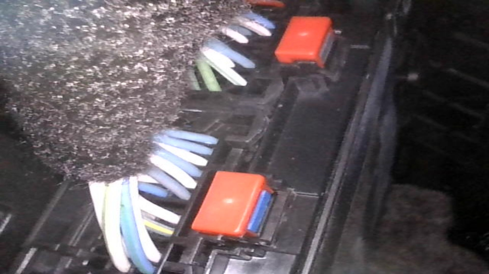
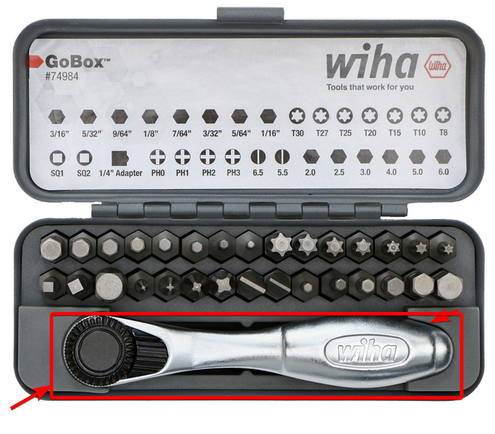

Overview

# Buy or Build harness
`mochi86420` on discord may sell them, or maybe `tinybear_` 

The build plans are in this repo, and this is a parts list with some suppliers to pick which is best for you
https://octopart.com/bom-tool/hvU9ddXU
Mouser seems necessary because they're the only ones with the correct connector (with a reasonable order minimum), 
but Digikey and LCSC have other parts cheaper.

# Disconnect 12v 
This is so that the car doesn't get mad as we tinker. 
Access the 12v battery in the trunk and disconnect it by removing the negative. It uses a 10mm hex.

# Access SDGM

This is the only kinda hard part. It's both 'high' and 'deep' in the left of the drivers footwell. 

It can be seen with the removal of the left door trim pieces. 
There are no screws holding in the left door trim pieces, so you just need to pop it off with some trim removal method. 
There are four clip locations, once loosened it will swing out towards the door to be removed 
I used a plastic trim removal stick as to not damage the plastic, but any flat screwdriver should be able to get the job done 

There are two connectors plugged into the bottom of the module. You will need to replace the one closer to the 
cabin(aka front), further from the engine, (aka rear). This connector is BLUE. As shown here

Now that you can see it that's only half the battle... To remove the connector you need to be able to touch it.
There are a few different options.

The first is somehow accessing it through this little window. I tried with a screwdriver but honestly 
I'm not sure it's possible to do entirely though here. 

So now we need to get into the footwell, 

[Your head here]

There is a small wall holding a module easily viewwable from the footwell. 

This is not what we want, but it is easy to remove go ahead and take it out by pushing in the clip below it. No need to 
remove it entirely, just pull it out so it's not in the way.

The SDGM is directly on the otherside of this wall. You might be able to wiggle it out from here using the clip, but
I was not so I went ahead and detached the wall. There are two reallllly easy to access screws here... and one that is horrible
These are 7mm hex.

The first is here, which requires removeing the odb2 port, easy enough. 

The second screw is here, also fairly easy.

But the third screw is allllll the way up here. Not easy to remove. 

You do have a few options though, 
a mini ratchet such as this one does work. I did use this to remove the screw, before I noticed the second option.

The second option is a Right Angle Drill Adaptor, you have plenty of space up here, so that's what I did to reinstall 
the screw, much easier, but also more specialized equipment.

**Finally** once those are all removed the wall should be movable, it's still attached with some wires but you should
now have the clearance to reach under and pull the SDGM out. It is on the other side of this clip here:

Now that you have the SDGM pulled out it, remove the forward, blue, connector by slightly pressing in on the blue tab, 
and pulling out the red clip. 

From here it should be straightforward enough to insert the removed connector into the harrnas, 
insert the new connector into the SDGM, 
connect to the comma box, add the comma power to the ODB2 and insert it into the comma box, 
and insert the USBC into the comma box, to be run to the dashcam. 
Now ziptie the connectors and wires down.

# Running USBC to the Dashcam

**DO NOT RUN IT OVER THE A PILAR.** There is an airbag here and a cable in front of it is a serious safety hazard.

Your options are running it under the floormat and directly up the center console, or inside the A Pilar trim.

It's a bit of a pain to get the A Pilar trim off, but once it's removed the run is easy. 
First run the USBC up the side and through the gap between the door and the inside of the a pilar

There are two clips, one plastic, close the the top of the pilar

and one metal, half way down the pilar

Once these are removed it will still be attached by some rubber cords but the harness is accessible to ziptie the usbc cable to

Now you can stuff the cord under the roof trim and through to the dashcam in the middle of the car.

# Mount to windshield

Using comma's directions setup the mount on the windshield. They say to allow 48 hours of curing for the mount
before attaching the camera

# Drive!